## **Advanced Lane Lines Finding**

Overview
---

The goals of this project is to write a software pipeline to identify the lane boundaries in a video using more advanced algorithms (comparing to the simple one <a href=https://mike9251.github.io/2018/05/26/lane-line-detector/>Udacity Self-Driving Car Project #1</a>). 
Final video:
<iframe width="560" height="315" src="https://www.youtube.com/embed/Qm8VF2G83gU?ecver=1" frameborder="0" allow="autoplay; encrypted-media" allowfullscreen></iframe>

Steps are the following:

* Compute the camera calibration matrix and distortion coefficients given a set of chessboard images.
* Apply a distortion correction to raw images.
* Use color transforms, gradients, etc., to create a thresholded binary image.
* Apply a perspective transform to rectify binary image ("birds-eye view").
* Detect lane pixels and fit to find the lane boundary.
* Determine the curvature of the lane and vehicle position with respect to center.
* Warp the detected lane boundaries back onto the original image.
* Output visual display of the lane boundaries and numerical estimation of lane curvature and vehicle position.

**Camera calibration and distortion correction**

<a href="https://docs.opencv.org/2.4/doc/tutorials/calib3d/camera_calibration/camera_calibration.html">OpenCV documentation</a>. 

 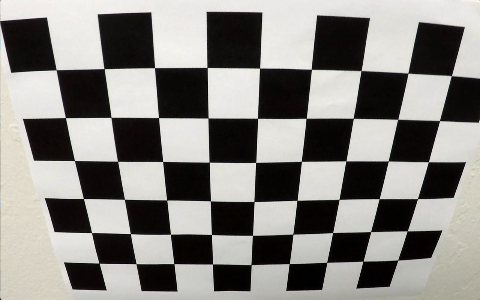 
 
Distorted chessboard image

 

 

 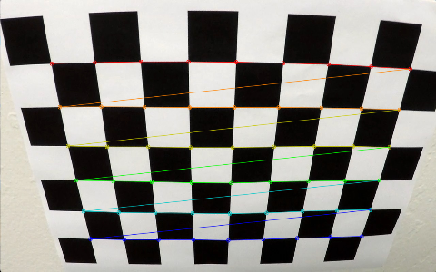
 
Distorted chessboard image

 

 

 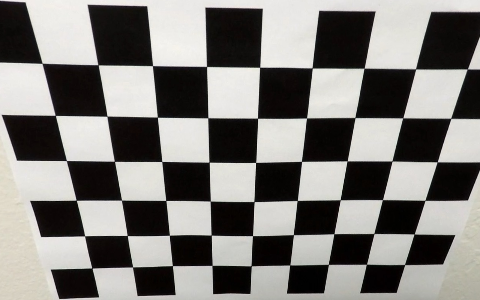
 
Undistorted chessboard image

 

 
 

 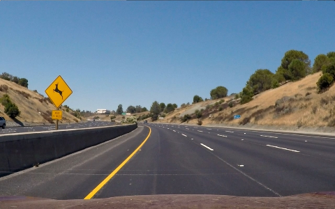
 
Original input image

 

 

 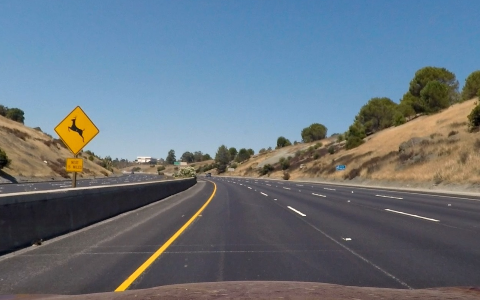
 
Undistorted input image

 

 **Creating a binary image**
 

 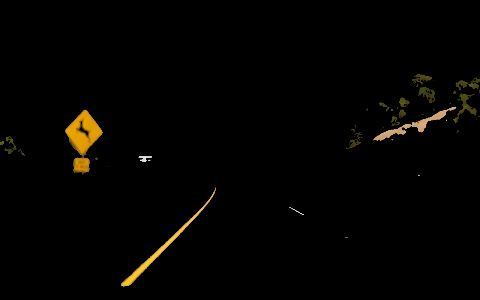
 
Yellow/White color extract image

 

 

 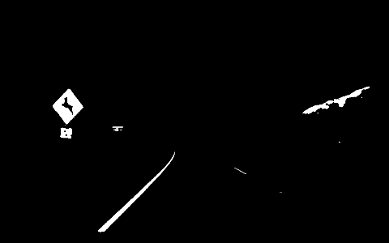
 
Yellow/White color extract image binarized

 

 

 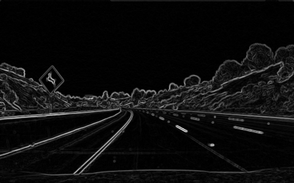
 
Sobel magnitude

 

 

 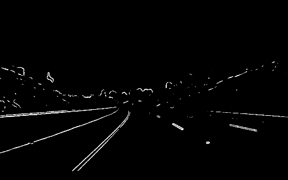
 
Binarized Sobel magnitude

 

 

 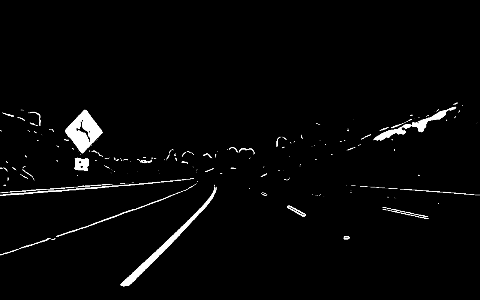
 
Binarized image

 

 
 

 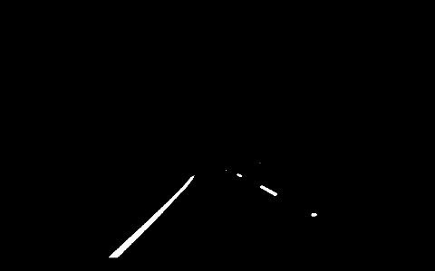
 
Preprocessed ROI

 

 
 **Applying perspective transform**
 

 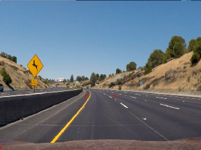
 
Input image

 

 

 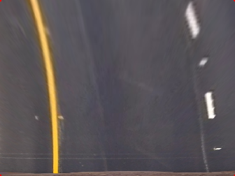
 
"birds-eye view" image

 

 
 **Detect the lane boundaries**
 

 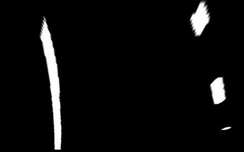
 
"birds-eye view" image

 

 

 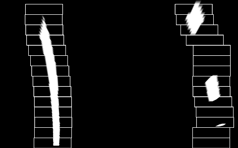
 
Detecting the lane lines

 

 

 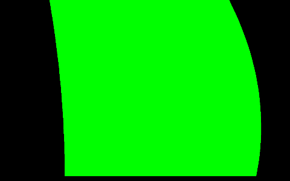
 
Detected lane

 

 
 **Determine the curvature of the lane and vehicle position with respect to center.**
 
 **Warp the detected lane boundaries back onto the original image. Final result.**
 

 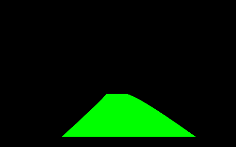
 
Unwarped Detected lane

 

 

 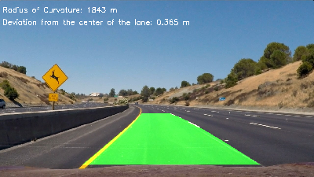
 
Result image

 

The images for camera calibration are stored in the folder called `camera_cal`.  The images in `test_images` are for testing your pipeline on single frames.  If you want to extract more test images from the videos, you can simply use an image writing method like `cv2.imwrite()`, i.e., you can read the video in frame by frame as usual, and for frames you want to save for later you can write to an image file.  

To help the reviewer examine your work, please save examples of the output from each stage of your pipeline in the folder called `output_images`, and include a description in your writeup for the project of what each image shows.    The video called `project_video.mp4` is the video your pipeline should work well on.  

The `challenge_video.mp4` video is an extra (and optional) challenge for you if you want to test your pipeline under somewhat trickier conditions.  The `harder_challenge.mp4` video is another optional challenge and is brutal!

If you're feeling ambitious (again, totally optional though), don't stop there!  We encourage you to go out and take video of your own, calibrate your camera and show us how you would implement this project from scratch!

## How to write a README
A well written README file can enhance your project and portfolio.  Develop your abilities to create professional README files by completing [this free course](https://www.udacity.com/course/writing-readmes--ud777).

