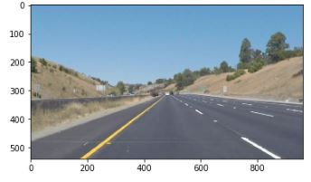

# **Finding Lane Lines on the Road** 

Overview
---

When we drive, we use our eyes to decide where to go.  The lines on the road that show us where the lanes are act as our constant reference for where to steer the vehicle.  Naturally, one of the first things we would like to do in developing a self-driving car is to automatically detect lane lines using an algorithm.

In this project you will detect lane lines in images using Python and OpenCV.  OpenCV means "Open-Source Computer Vision", which is a package that has many useful tools for analyzing images.  

To complete the project, two files will be submitted: a file containing project code and a file containing a brief write up explaining your solution. We have included template files to be used both for the [code](https://github.com/udacity/CarND-LaneLines-P1/blob/master/P1.ipynb) and the [writeup](https://github.com/udacity/CarND-LaneLines-P1/blob/master/writeup_template.md).The code file is called P1.ipynb and the writeup template is writeup_template.md 

To meet specifications in the project, take a look at the requirements in the [project rubric](https://review.udacity.com/#!/rubrics/322/view)

Writeup
---
The first task of the Self-Driving Car course is to create a simple lane line detector. The implemented script works with video only

*1. Pipeline*
 - load an image
 
 - convert it into HSL color space, extract white and yellow lines  - IMPORTANT - really helps in challenge video case
 - convert the result of the previous stage into a gray scale
 - perform filtering with the Gaussian filter
 - find edges with the Canny edge detector
 - define a region of interest (a region where we'll look for lane lines)
 - find lines from the edge points with the Hough algorithm
 - separate found lines on left and right lines, calculate an average left/right lines
 - draw lane lines
 
 *Usage:* python pipeline.py test_videos\solidYellowLeft.mp4

*2. Identify any shortcomings*

Current implementation suffers to accurately identify curved lane lines.

*3. Suggest possible improvements*

-One possible way to improve accuracy of lane line detection is to apply extraction masks (white, yellow) to the input image - Done.
This method really helps, detector more accurately finds lines.

- To increase accuracy of curved line detection try to apply some different methods for outlier lane line rejection.

